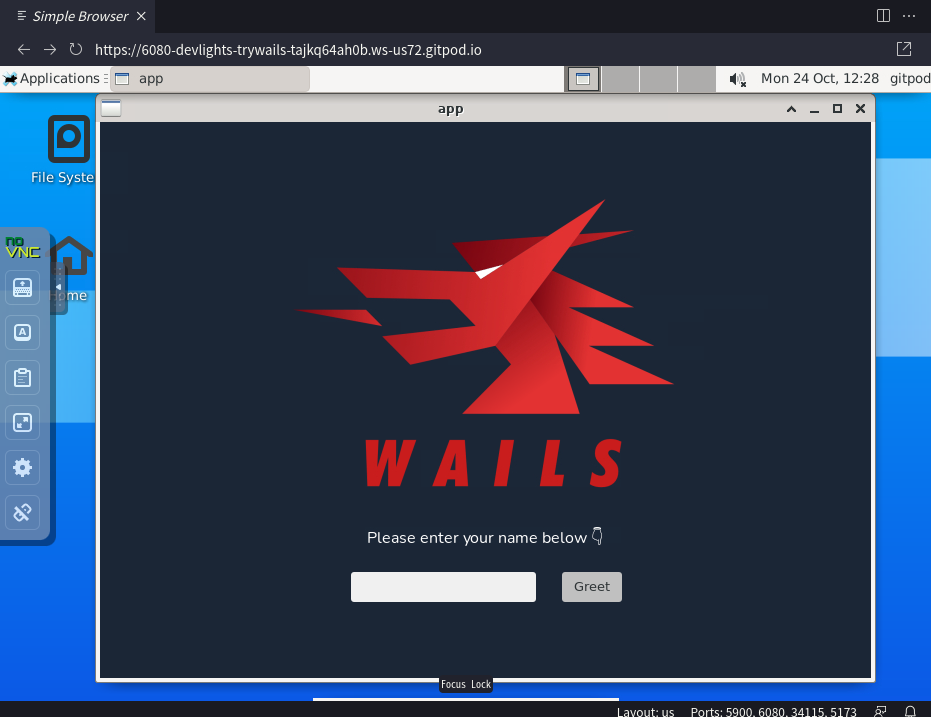

# try-wails

This is my TUTORIAL project for [Wails (v2)](https://wails.io/).

This project is intended to run on gitpod.

## Wails version

```sh
$ wails version
v2.1.0

If Wails is useful to you or your company, please consider sponsoring the project:
https://github.com/sponsors/leaanthony
```

## Wails doctor

```sh
$ wails doctor
Wails CLI v2.1.0

Scanning system - Please wait (this may take a long time)...Done.

System
------
OS:             Ubuntu
Version:        20.04
ID:             ubuntu
Go Version:     go1.19.2
Platform:       linux
Architecture:   amd64

Wails
------
Version:                v2.1.0
Package Manager:        apt

Dependency      Package Name            Status          Version
----------      ------------            ------          -------
*docker         docker.io               Installed       20.10.17
gcc             build-essential         Installed       12.8ubuntu1.1
libgtk-3        libgtk-3-dev            Installed       3.24.20-0ubuntu1.1
libwebkit       libwebkit2gtk-4.0-dev   Installed       2.36.8-0ubuntu0.20.04.1
npm             npm                     Installed       8.19.2
*nsis           nsis                    Installed       v3.05-2
pkg-config      pkg-config              Installed       0.29.1

* - Optional Dependency

Diagnosis
---------
Your system is ready for Wails development!


If Wails is useful to you or your company, please consider sponsoring the project:
https://github.com/sponsors/leaanthony
```

## Run

```sh
$ wails init -n app -t svelte
Wails CLI v2.1.0

Initialising Project 'app'
--------------------------

go: downloading github.com/matryer/is v1.4.0
go: downloading github.com/stretchr/testify v1.7.1
go: downloading github.com/labstack/echo/v4 v4.9.0
go: downloading github.com/leaanthony/go-ansi-parser v1.0.1
go: downloading github.com/tkrajina/go-reflector v0.5.5
go: downloading github.com/bep/debounce v1.2.1
go: downloading github.com/wailsapp/mimetype v1.4.1
go: downloading github.com/jchv/go-winloader v0.0.0-20210711035445-715c2860da7e
go: downloading github.com/go-ole/go-ole v1.2.6
go: downloading github.com/google/uuid v1.1.2
go: downloading github.com/davecgh/go-spew v1.1.1
go: downloading github.com/pmezard/go-difflib v1.0.0
go: downloading golang.org/x/text v0.3.7
go: downloading github.com/valyala/fasttemplate v1.2.1
go: downloading github.com/valyala/bytebufferpool v1.0.0
go: downloading gopkg.in/yaml.v2 v2.3.0
Project Name:      app
Project Directory: /workspace/try-wails/app
Project Template:  svelte
Template Support:  https://wails.io

Initialised project 'app' in 1.712s.


If Wails is useful to you or your company, please consider sponsoring the project:
https://github.com/sponsors/leaanthony
```

```sh
$ cd app

$ wails dev
Wails CLI v2.1.0

Executing: go mod tidy
  - Generating bindings: Done.
  - Installing frontend dependencies: Done.
  - Compiling frontend: Done.

> frontend@0.0.0 dev
> vite


  VITE v3.1.8  ready in 321 ms

Vite Server URL: http://127.0.0.1:5173/
  ➜  Local:   http://127.0.0.1:5173/
  ➜  Network: use --host to expose
Running frontend DevWatcher command: 'npm run dev'
Building application for development...
  - Generating bindings: Done.
  - Compiling application: Done.
  - Packaging application: Done.
```


